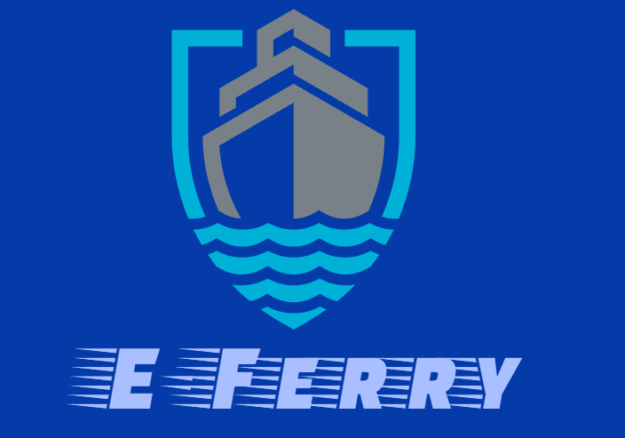

# e-ferry

Link de download da aplicação : 

Screencast da Aplicação: https://www.youtube.com

Projeto da disciplina Engenharia de Software, do curso de graduação em tecnologia de Análise e Desenvolvimento de Sistemas do  Instituto Federal de Educação, Ciência e Tecnologia da Bahia, Campus Santo Antônio de Jesus (IFBA-SAJ).

# Equipe:
● Erik Teixeira Lisboa (eriklisboa1) - Gerente de Projeto

● Gustavo Vitor Oliveira de Andrade (P3iX0nauta) - Engenheiro de Requisitos

● Herbert Luan Passos Pinheiro (herbertlpp) - Arquiteto de Sistema

● João Gabriel de Deus Pinheiro (JoaoGabrielDPinheiro) - Projetista de Banco de Dados

● Salvador Cerqueira Júnior (SalvadorCerqueiraJr) - Analista de Sistema

# Descrição:
Desenvolver aplicação acessível ao público e de fácil manuseio com informações acerca dos horários de saída, chegada, entre outras informações do Ferry Boat Salvador dos dois lados (Ilha de Itaparica e Salvador) no menor intervalo de tempo possível, opção de recarga do Ferry Card, Comprar passagem antecipadamente (Hora Marcada), Filômetro,  Informação sobre as tarifas entre outras facilidades, além de um serviço SAC e Suporte Técnico.

# Justificativa:
Devido a pouca ou a falta de informação que é fornecida pela empresa acerca dos horários do ferry, e a dificuldade de acessibilidade às informações que são disponibilizadas, sobre filômetro, preço de tarifas, previsão de chegada, quantidade de ferrys que estão em funcionamento, informações acerca de possíveis atrasos, a aplicação
